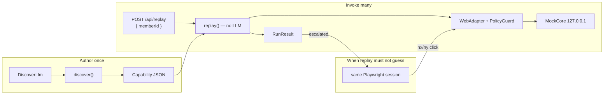
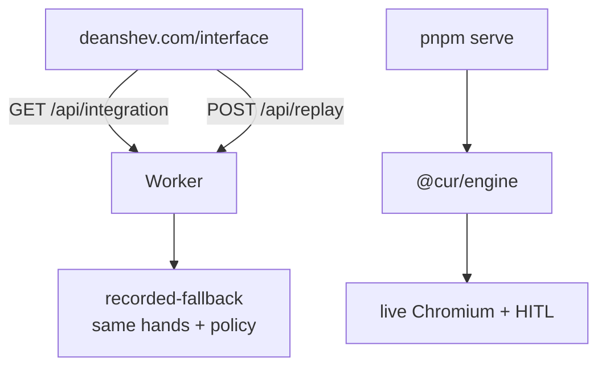

# computer-use-runtime

A capability runtime: an LLM discovers a flow on a live UI once, the run is compiled into a typed artifact, and production replay invokes that artifact **with no model in the decision loop**. When replay cannot safely continue, a human takes over the **same** browser session.

This is the public take-home for interface.ai Assignment A. Clone this repo. You do not need Cloudflare or Supabase to evaluate it.

**Architecture:** [docs/ARCHITECTURE.md](./docs/ARCHITECTURE.md) · **Wired diagrams:** [docs/DIAGRAMS.md](./docs/DIAGRAMS.md) · [docs index](./docs/README.md)

## Architecture wiring

Record once. Replay many. The model is not in the production loop. The public briefing draws the same maps at [deanshev.com/interface#wiring](https://deanshev.com/interface#wiring).





Hands on the core: `type` textbox **Member ID** → `click` button **Look up** → `extract` status **Savings balance**. Full connection maps: [docs/DIAGRAMS.md](./docs/DIAGRAMS.md).

## Setup

Requires Node 22+ and [pnpm](https://pnpm.io).

```bash
pnpm install
pnpm exec playwright install chromium
```

No API key is required for tests or the demo path below. The discover loop uses a scripted fake LLM unless you set `LLM_PROVIDER`.

```bash
cp .env.example .env   # optional
```

## Demo path (assignment)

Terminal 1 — mock credit-union core (localhost only):

```bash
pnpm bank
```

Terminal 2 — discover, then replay:

```bash
pnpm discover -- --goal "look up the member and read their current savings balance" --target http://127.0.0.1:4177/ --param memberId=12345 --sensitivity memberId=pii --llm fake

pnpm replay -- --artifact evidence/capabilities/lookup-savings-balance.json --target http://127.0.0.1:4177/ --param memberId=12345

pnpm replay -- --artifact evidence/capabilities/lookup-savings-balance.json --target http://127.0.0.1:4177/ --param memberId=99999

pnpm replay -- --artifact evidence/capabilities/lookup-savings-balance.json --target http://127.0.0.1:4177/ --param memberId=12345 --chaos timeout
```

Expected: first replay `status: success` with `savingsBalance`; second replay `status: business_outcome` / `MEMBER_NOT_FOUND`; third replay `status: failed` / `TIMEOUT` with a screenshot on the result (add `--trace` for a Playwright `trace.zip`).

The discover command rewrites `evidence/capabilities/lookup-savings-balance.json` and adds a `discovery-*` folder. `git checkout -- evidence` restores the checked-in pack.

Human handoff (same live session):

```bash
pnpm serve
```

`pnpm serve` starts its own mock bank (localhost, console port + 1). You do not need the Terminal 1 `pnpm bank` process for the console.

Open `http://127.0.0.1:8787`. **Replay until handoff** types the Member ID, then pauses. Click Look up in the frame (`nx`/`ny`). Resume continues extract on the same session.

## Run without live services

```bash
pnpm test
```

Uses the fake LLM and an in-process bank. No provider key, no Cloudflare.

## Live model (optional)

```bash
export LLM_PROVIDER=zai
export LLM_MODEL=glm-5.3-flash
export ZAI_API_KEY=...
pnpm discover -- --goal "look up the member and read their current savings balance" --target http://127.0.0.1:4177/ --param memberId=12345 --sensitivity memberId=pii --llm zai
```

That is the command that produced `evidence/discovery-4c1ef589`. Rebuild the whole pack with `LLM_PROVIDER=zai LLM_MODEL=glm-5.3-flash pnpm evidence`. Other providers (`openai`, `anthropic`, `google`, `xai`, `openrouter`, `venice`) work the same way.

A weak or poorly prompted model may loop on `type` and leave a **draft**. The checked-in live run finished and extracted. The default replayable artifact is still the compiled / fake-LLM discovery.

## Layout

- `docs/` — architecture, wired diagrams, TOC, trade-offs
- `packages/schema` — Zod 4 capability / result contracts; JSON Schema in `/schemas`
- `packages/engine` — Playwright adapter, policy, discover, replay, HITL session
- `apps/bank` — hostile mock core (tables, iframe, no test IDs), localhost only
- `apps/console` — operator UI
- `apps/worker` — hosted coordinator (recorded fallback if Containers are not live)
- `cli` — `discover` | `replay` | `serve`
- `evidence/` — fake-LLM discovery, success replay, not-found + `trace.zip`, HITL session
- `apps/worker/SPIKE.md` — hosted Container go/no-go; recorded fallback is the live default
- `REPORT.md` — short assignment write-up (full design is in `docs/`)

## Hosted demo (extra)

- Briefing: [https://deanshev.com/interface](https://deanshev.com/interface)
- Recorded replay: [https://interface.deanshev.com](https://interface.deanshev.com)

The hosted console is **recorded-fallback**. It never drives a browser. What it does run live is the engine's own Chromium-free logic — `PolicyGuard`, the Zod capability schema, Playwright codegen, route canonicalization — and it serves the committed `/evidence` pack (discovery transcripts with provider response ids, replay results, masked screenshots, traces, HITL session, stability). The briefing labels every panel as live logic, recorded evidence, or design. Clone this repo for live discover, replay, and HITL. The graded artifact is this repository.
