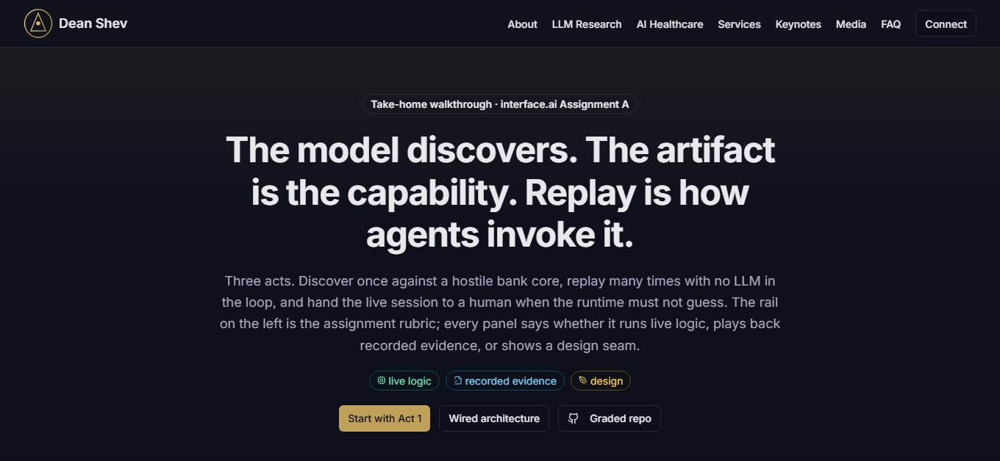
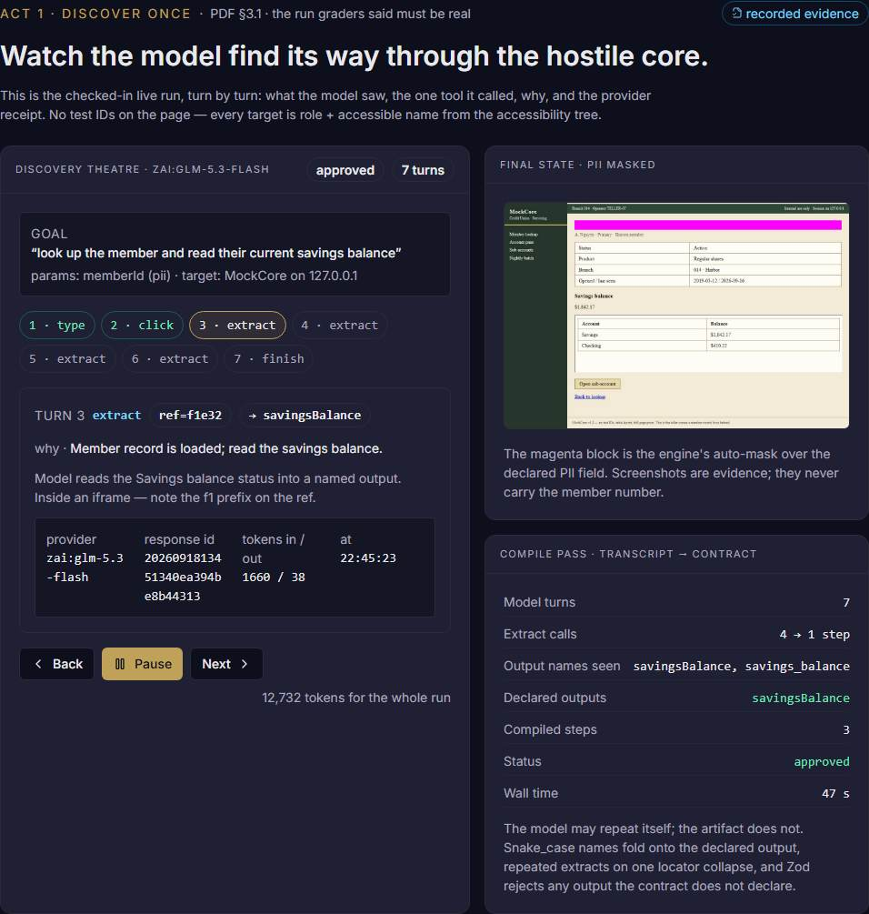
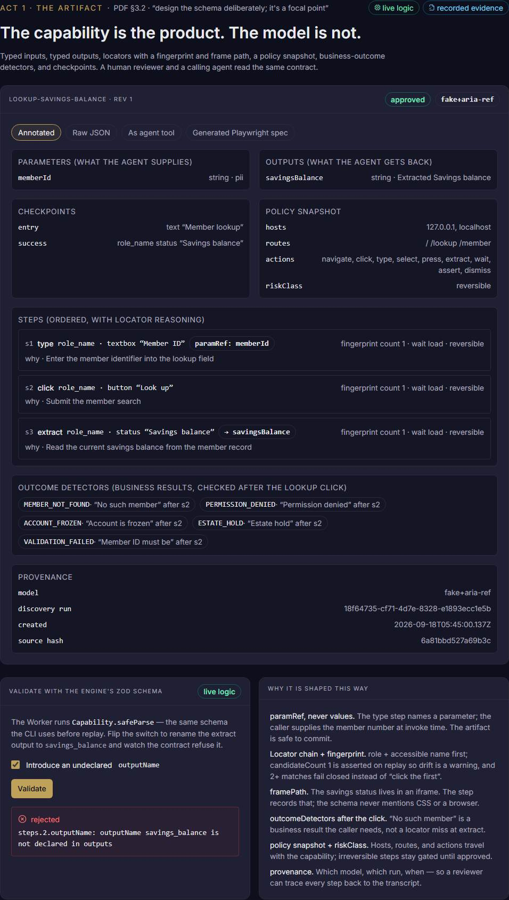
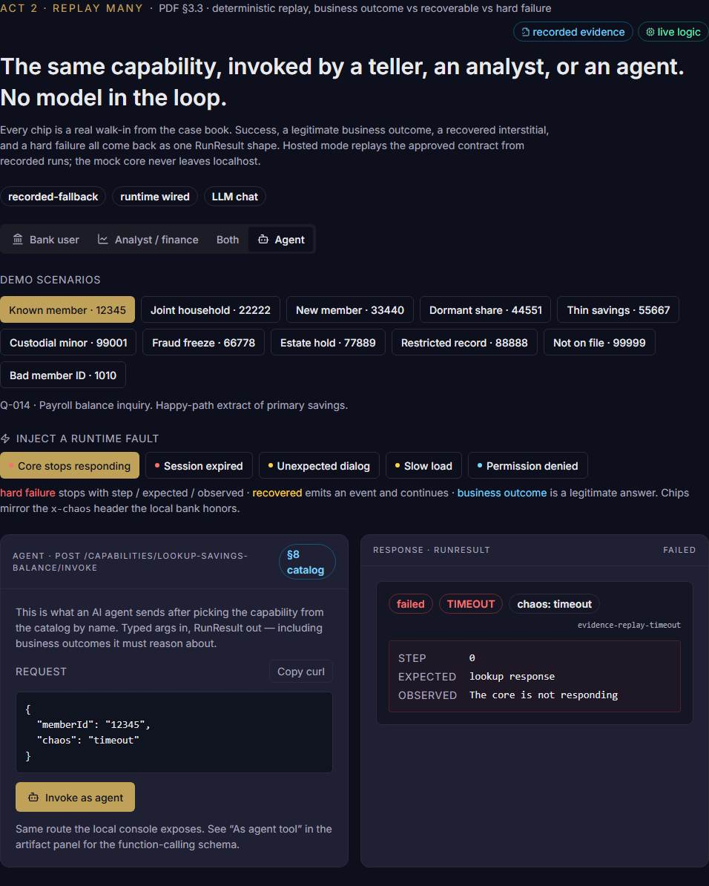
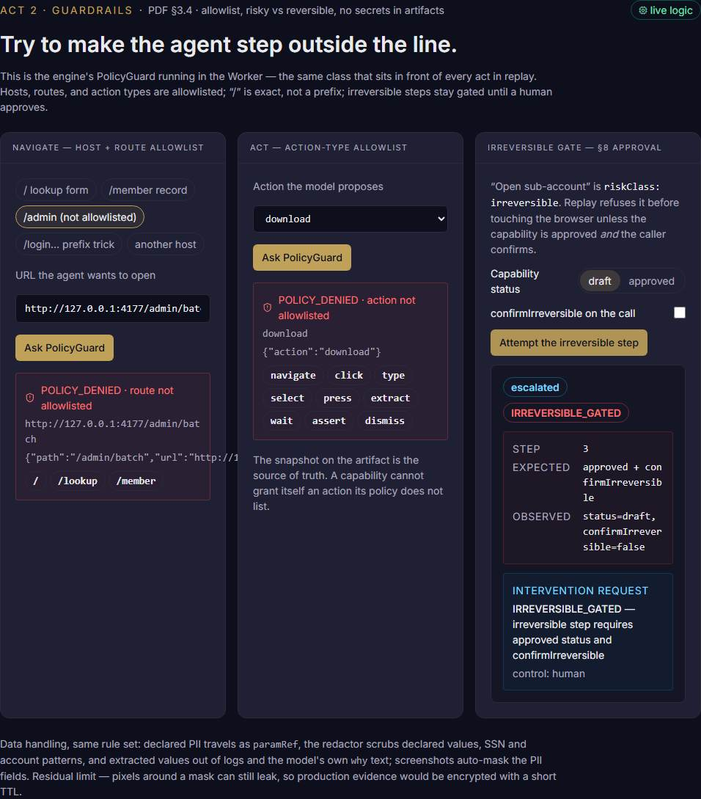
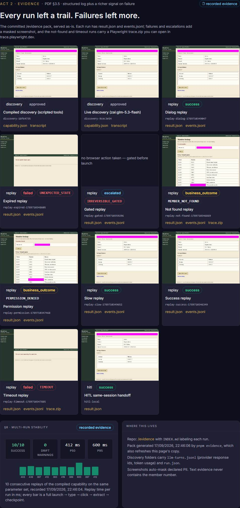
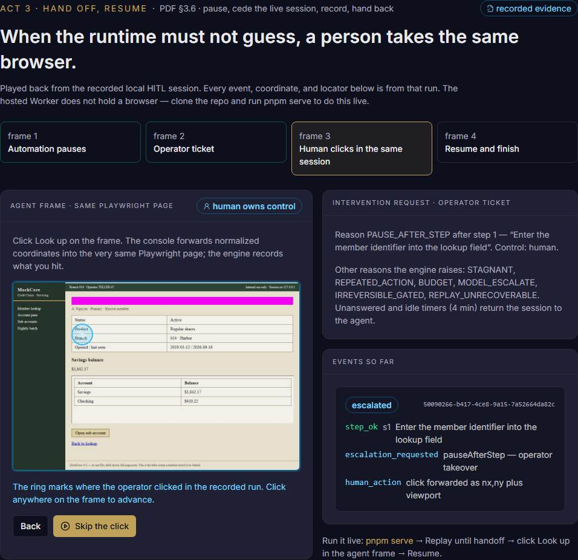

# computer-use-runtime

Take-home submission for **interface.ai — Assignment A, Computer-Use Automation System**.

A capability runtime: an LLM discovers a flow on a live, hostile bank UI **once**; the run is compiled into a typed, versioned artifact; production replay invokes that artifact **with no model in the decision loop**; and when replay cannot safely continue, a human takes over the **same** browser session and hands it back.

- Design write-up: [REPORT.md](./REPORT.md) (the seven required headings, with links into the long-form docs)
- Long-form architecture: [docs/ARCHITECTURE.md](./docs/ARCHITECTURE.md) · wired diagrams: [docs/DIAGRAMS.md](./docs/DIAGRAMS.md) · docs index: [docs/README.md](./docs/README.md)
- Evidence: [evidence/INDEX.md](./evidence/INDEX.md)

## Hosted demo (extra, not the graded artifact)

- **Walkthrough:** [deanshev.com/interface](https://deanshev.com/interface) — three acts mapped to the assignment sections, with a rubric rail that lights up as you go.
- **Runtime:** [interface.deanshev.com](https://interface.deanshev.com)

The hosted Worker **never drives a browser**. What it runs live is the engine's own Chromium-free code — `PolicyGuard`, the Zod capability schema, Playwright codegen, route canonicalization — and it serves this repository's `/evidence` pack. Every panel is labeled **live logic**, **recorded evidence**, or **design**. Clone the repo for live discover, replay, and HITL.

[](https://deanshev.com/interface)

| Act 1 · Discover once (§3.1) | Act 1 · The artifact (§3.2) |
| --- | --- |
| [](https://deanshev.com/interface#discover) | [](https://deanshev.com/interface#artifact) |

| Act 2 · Replay many (§3.3, §8 agent catalog) | Act 2 · Guardrails (§3.4, §8 approval) |
| --- | --- |
| [](https://deanshev.com/interface#replay) | [](https://deanshev.com/interface#safety) |

| Act 2 · Evidence (§3.5, §8 stability) | Act 3 · Hand off, resume (§3.6) |
| --- | --- |
| [](https://deanshev.com/interface#evidence) | [](https://deanshev.com/interface#handoff) |

## Deliverables checklist

Everything the assignment asks for, where it lives, and how to check it.

| Assignment asks | Where | Verify |
| --- | --- | --- |
| Public git repo with source | this repository | `git clone`, `pnpm install`, `pnpm test` |
| `/README.md` — setup, keys/config, run without live services, exact demo commands | this file | sections below |
| `/REPORT.md` — 1–3 pages, seven exact headings | [REPORT.md](./REPORT.md) | headings 1 Architecture · 2 Artifact schema · 3 Determinism & error handling · 4 Heterogeneity & multi-tenant · 5 Escalation & handoff · 6 Safety · 7 Cuts |
| `/evidence/` — saved artifact + discovery log + replay log, one exceptional replay | [evidence/](./evidence) | [INDEX.md](./evidence/INDEX.md) labels every run |
| **At least one genuine LLM-driven discovery run** | `evidence/discovery-9cec3e54` (`zai:glm-5.3-flash`) | `transcript.redacted.jsonl` (tool calls), `llm-turns.jsonl` (provider response ids, token usage), `run.json`, `screenshots/final.jpg` |
| §3.1 Goal-driven agent loop on a real UI | `packages/engine/src/discover.ts`, `web-adapter.ts` | `pnpm discover …` below; accessibility-tree targeting, no test IDs |
| §3.2 Typed, versioned, reviewable artifact | `packages/schema/src/capability.ts`, [schemas/capability.v1.json](./schemas/capability.v1.json) | [evidence/capabilities/lookup-savings-balance.json](./evidence/capabilities/lookup-savings-balance.json) |
| §3.3 Deterministic replay; business outcome vs recoverable vs hard failure | `packages/engine/src/replay.ts`, `packages/schema/src/run-result.ts` | `pnpm replay …` for 12345 / 99999 / `--chaos timeout`; evidence runs: success, not-found, permission, timeout, expired, dialog, slow, gated |
| §3.4 Allowlist, risky vs reversible, no secrets or PII in artifacts/logs | `packages/engine/src/policy.ts`, `redact.ts`, screenshot masks | `tests/policy.test.ts`, `tests/redact.test.ts`; `replay-gated-*`; grep the evidence for a member number — none |
| §3.5 Structured log + richer signal on failure | `events.jsonl` + `result.json` per run; screenshot and `trace.zip` on failure | `replay-not-found-*/trace.zip`, `replay-timeout-*/trace.zip` |
| §3.6 Detect stuck, route an intervention with context, human takes the live session, hand back | `packages/engine/src/session.ts`, `replay.ts`, `cli/src/serve.ts`, `packages/schema/src/intervention.ts` | `pnpm serve` walkthrough below; [evidence/hitl-local](./evidence/hitl-local) |
| §3.7 Heterogeneity + multi-tenant design | [REPORT §4](./REPORT.md#4-heterogeneity--multi-tenant), `interfaces.ts`, `tenant.ts` | design + schema; runtime is a documented cut |
| §8 stretch (optional) | agent invoke route, Playwright codegen, approval gate, canonicalization, stability | `POST /capabilities/:id/invoke`; `evidence/stability.json`; Worker `logic.ts` |

## Setup

Requires Node 22+ and [pnpm](https://pnpm.io).

```bash
pnpm install
pnpm exec playwright install chromium
```

No API key is required for tests or the demo path. The discover loop uses a scripted fake LLM unless you set `LLM_PROVIDER`.

```bash
cp .env.example .env   # optional; documents every variable
```

## Demo path (assignment)

Terminal 1 — start the mock credit-union core. It binds to loopback only.

```bash
pnpm bank
```

Terminal 2 — run the agent on a goal, then replay the resulting artifact with different inputs.

```bash
# 1. Discover: goal + target + typed param. Fake LLM by default; see "Live model" to use a real provider.
pnpm discover -- --goal "look up the member and read their current savings balance" --target http://127.0.0.1:4177/ --param memberId=12345 --sensitivity memberId=pii --llm fake

# 2. Replay the artifact (no LLM). Known member → success with the declared output.
pnpm replay -- --artifact evidence/capabilities/lookup-savings-balance.json --target http://127.0.0.1:4177/ --param memberId=12345

# 3. Same artifact, unknown member → a business outcome, not a crash.
pnpm replay -- --artifact evidence/capabilities/lookup-savings-balance.json --target http://127.0.0.1:4177/ --param memberId=99999

# 4. Inject a runtime fault → a hard failure with step / expected / observed, a screenshot, and a Playwright trace.
pnpm replay -- --artifact evidence/capabilities/lookup-savings-balance.json --target http://127.0.0.1:4177/ --param memberId=12345 --chaos timeout --trace
```

Expected: (2) `status: success`, `outputs.savingsBalance: "$1,842.17"`; (3) `status: business_outcome`, `outcome: MEMBER_NOT_FOUND`; (4) `status: failed`, `failure.code: TIMEOUT`, `evidence.screenshots[0]` and `evidence.trace` set. Other `--chaos` values: `expired`, `dialog`, `slow`, `permission`, `validation`, `not_found`.

Every run writes a `replay-*` folder under `/evidence` with `result.json` and `events.jsonl`. The discover command rewrites `evidence/capabilities/lookup-savings-balance.json`; `git checkout -- evidence` restores the checked-in pack.

### Human handoff (same live session)

```bash
pnpm serve
```

`pnpm serve` starts its own mock bank (console port + 1); Terminal 1 is not needed. Open `http://127.0.0.1:8787`.

1. **Pause for teller** — replay types the Member ID, then pauses. The session owner flips to `human`; agent acts now throw. `GET /api/session/:id` returns the `InterventionRequest` (capability, goal, step, reason, who owns control).
2. Click **Look up** on the agent frame. The console forwards `{nx, ny, viewport}` into the same Playwright page and records the locator the click resolved to.
3. **Resume after human** — control returns to the agent; replay continues from `pausedAfter + 1`, treats the already-performed click as satisfied, and extracts the balance.

The same flow is captured in [evidence/hitl-local](./evidence/hitl-local).

## Run without live services

```bash
pnpm test        # typecheck + 44 tests: schema, policy, discover, replay taxonomy, HITL, redaction, console invoke
pnpm typecheck
```

Tests use the fake LLM and an in-process bank. No provider key, no Cloudflare.

## Live model (optional, and how the checked-in run was made)

```bash
export LLM_PROVIDER=zai
export LLM_MODEL=glm-5.3-flash
export ZAI_API_KEY=...            # never committed; see .env.example
pnpm discover -- --goal "look up the member and read their current savings balance" --target http://127.0.0.1:4177/ --param memberId=12345 --sensitivity memberId=pii --llm zai
```

`LLM_PROVIDER` also accepts `openai`, `anthropic`, `google`, `xai`, `openrouter`, `venice`. The provider is loaded dynamically through the Vercel AI SDK; the tool contract (`type`, `click`, `extract`, `finish`, `escalate`) is ours.

A run is `approved` only if the model called `finish` after at least one successful `extract`; otherwise it is labeled `draft`. Rebuild the entire evidence pack (compiled + live discovery, all replay classes, HITL, stability) with:

```bash
LLM_PROVIDER=zai LLM_MODEL=glm-5.3-flash pnpm evidence
```

Without `LLM_PROVIDER`, `pnpm evidence` regenerates everything except the live run, which it preserves.

## Evidence pack

See [evidence/INDEX.md](./evidence/INDEX.md). In short:

- `discovery-18f64735` — compiled discovery with scripted tools (the default replayable artifact).
- `discovery-9cec3e54` — live `zai:glm-5.3-flash` run, `approved`; transcript, per-turn provider metadata, masked screenshot.
- `replay-success-*`, `replay-not-found-*` (+ trace), `replay-permission-*` — success and business outcomes.
- `replay-timeout-*` (+ trace), `replay-expired-*` — hard failures with screenshot.
- `replay-dialog-*`, `replay-slow-*` — recovered conditions.
- `replay-gated-*` — escalated `IRREVERSIBLE_GATED` before any browser action.
- `hitl-local/` — pause, human click with resolved locator, resume, success.
- `stability.json` — 10 consecutive replays, 10/10, p50 / p95 timings.

Screenshots mask declared PII. No member number or extracted value appears in any text file except as a declared output.

## Layout

- `packages/schema` — Zod 4 contracts: capability, run result, intervention request, app profile, tenant binding; JSON Schema in `/schemas`
- `packages/engine` — Playwright `SurfaceAdapter`, `PolicyGuard`, discover loop + compile pass, replay interpreter, `Session`/HITL, redaction, file store
- `apps/bank` — hostile mock core: tables, iframe, server-rendered posts, no test IDs, `x-chaos` faults; loopback only
- `apps/console` — operator UI served by `pnpm serve`
- `apps/worker` — hosted coordinator (recorded-fallback; runs the engine's Chromium-free logic and serves the evidence pack)
- `cli` — `discover` | `replay` | `serve`
- `scripts` — `write-evidence.ts` (rebuilds `/evidence`), `sync-worker-evidence.ts`
- `tests` — vitest suites
- `docs` — architecture (25 sections), wired diagrams, screenshots of the hosted walkthrough, index
