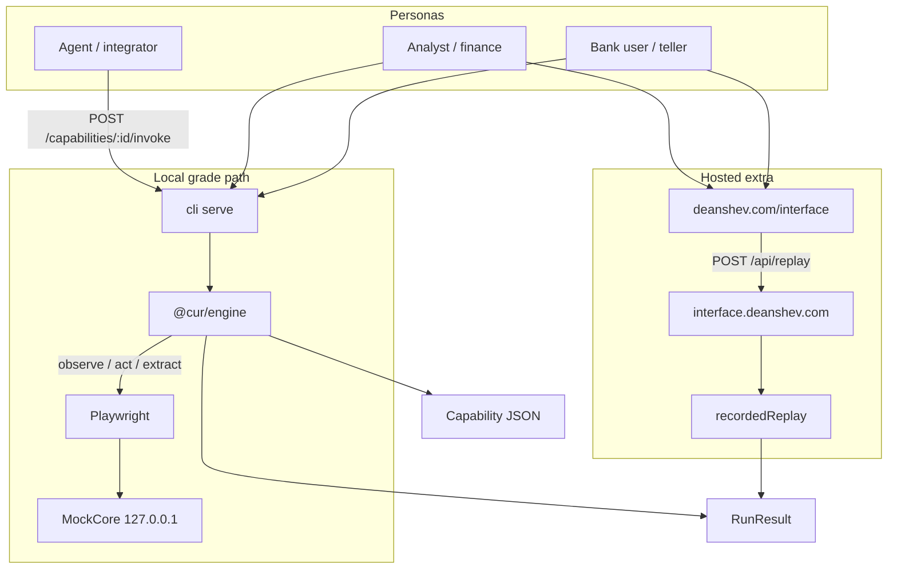

# Architecture

A capability runtime: an LLM discovers a UI flow once, the run compiles into a typed artifact, and production replay invokes that artifact **with no model in the decision loop**. When replay cannot safely continue, a human takes over the **same** browser session.

This document is the design and implementation record. It is written against the code in this repository, not against a slide deck.

## Table of contents

1. [What this system is](#1-what-this-system-is)
2. [Design thesis](#2-design-thesis)
3. [System map](#3-system-map) · [wired diagrams](./DIAGRAMS.md)
4. [Repository layout](#4-repository-layout)
5. [Schema and contracts](#5-schema-and-contracts)
6. [SurfaceAdapter](#6-surfaceadapter)
7. [PolicyGuard](#7-policyguard)
8. [Discover](#8-discover)
9. [Replay](#9-replay)
10. [Session and HITL](#10-session-and-hitl)
11. [AppProfile and outcome detectors](#11-appprofile-and-outcome-detectors)
12. [Parameters and redaction](#12-parameters-and-redaction)
13. [Store and evidence](#13-store-and-evidence)
14. [Mock bank](#14-mock-bank)
15. [Case book](#15-case-book)
16. [Operator console](#16-operator-console)
17. [CLI](#17-cli)
18. [Hosted worker](#18-hosted-worker)
19. [Briefing as an integration client](#19-briefing-as-an-integration-client)
20. [Outcome taxonomy](#20-outcome-taxonomy)
21. [Safety model](#21-safety-model)
22. [Testing](#22-testing)
23. [Trade-off catalog](#23-trade-off-catalog)
24. [Explicit cuts](#24-explicit-cuts)
25. [What we would change next](#25-what-we-would-change-next)

---

## 1. What this system is

The product is not a chatbot that drives a browser. The product is a **callable capability**.

A capability is a versioned JSON contract: typed inputs, typed outputs, an ordered step list, locators that prefer the accessibility tree, a policy snapshot, and detectors that classify expected business exceptions. Discover is how you author the contract. Replay is how you invoke it. HITL is how you recover without abandoning the live page.

The demo target is a hostile mock credit-union core (MockCore). The seeded flow is **look up a member and read their current savings balance**. That is a reversible inquiry. Opening a sub-account is present on the bank as an irreversible control so the gate can be proven.

Three audiences share one contract:

| Audience | Surface | What they do |
| --- | --- | --- |
| Bank user / teller | MockCore on loopback, or the hosted reconstruction | Types a member ID, reads the card, sees a freeze or estate hold |
| Analyst / finance | Local console or hosted desk | Discovers, replays, pauses, resumes, inspects `RunResult` |
| Agent / integrator | `POST /capabilities/:id/invoke` and `POST /api/replay` | Calls the capability as a tool; never owns CSS or Playwright |

The take-home is this repository. Cloudflare is an extra. No cloud account is required to grade it.

---

## 2. Design thesis

Computer-use in production fails when every invocation re-plans. Tokens, non-determinism, and policy leaks all come from leaving a model in the loop after the path is known.

The thesis:

1. **Record once.** An LLM sees an accessibility snapshot and picks tools. Discover records the resolved locator after the act, not the model's raw guess.
2. **Replay many.** Production walks the compiled steps. No `generateText`. No tool choice.
3. **Classify, do not improvise.** Expected core messages (`No such member`, `Account is frozen`) are `business_outcome`. Unexpected UI is `failed` or `escalated`.
4. **Handoff the same session.** A new browser after pause loses cookies, chaos, and the typed field. `pauseAfterStep` / `resumeFrom` / `skipLaunch` keep the Playwright page.
5. **Own the adapter.** Playwright + `ariaSnapshot` is an implementation of `SurfaceAdapter`. A desktop adapter would implement the same methods. The capability JSON does not mention CSS or a browser.

That last point is why we did not use Stagehand, Browserbase, Anthropic `browser_toolset`, or OpenAI CUA as the runtime. Their observe → act cache is the same *idea*. Ours differs: typed I/O, first-class detectors, a policy snapshot on the artifact, a same-session HITL seam, and an adapter we can swap.

---

## 3. System map

Labeled connection maps for every layer live in [DIAGRAMS.md](./DIAGRAMS.md). The briefing renders the same wiring at [deanshev.com/interface#wiring](https://deanshev.com/interface#wiring).



The same engine package runs in the CLI, in Vitest, and behind `pnpm serve`. The Worker does **not** import Playwright. It returns the `RunResult` shape from the case book so a public HTTPS page can demonstrate the integration layer without pretending it has a browser.

---

## 4. Repository layout

pnpm workspaces. Node 22+. TypeScript. Zod 4 is the source of truth for contracts; JSON Schema in `/schemas` is generated.

| Path | Role |
| --- | --- |
| `docs/` | Architecture write-up and [wired diagrams](./DIAGRAMS.md) |
| `packages/schema` | Zod contracts: capability, profile, tenant, policy, run result, events |
| `packages/engine` | Adapter, policy, discover, replay, session, LLM, redaction, store |
| `apps/bank` | Hostile MockCore. Localhost only. No test IDs |
| `apps/console` | Dual-pane React desk (teller + analyst) |
| `apps/worker` | Cloudflare Worker + Durable Object + recorded-fallback |
| `cli` | `discover` · `replay` · `serve` |
| `tests` | Schema, policy, replay, HITL, serve, redaction |
| `evidence` | Compiled discovery, approved live run, success / not-found / permission, HITL |
| `schemas` | Committed JSON Schema (`capability.v1.json`, …) |

Host-agnostic seams: `SurfaceAdapter`, `Store`, `DiscoverLlm`, `SessionControl`. File paths and Playwright stay behind those interfaces.

---

## 5. Schema and contracts

**Design.** A capability is a callable, not a transcript. Multi-tenant must not become a blob of per-credit-union overrides, so the schema is three layers:

| Layer | Owns | v1 status |
| --- | --- | --- |
| `AppProfile` | Vendor product recoveries: entry, interstitials, session-expired, error patterns | Runtime |
| `Capability` | The flow: params, steps, detectors, policy snapshot, provenance | Runtime |
| `TenantBinding` | Base URL and locator overrides | Schema only |

**Implementation.** `packages/schema/src/capability.ts` and `types.ts`. `pnpm schemas` writes `/schemas/*.v1.json` via Zod 4 `z.toJSONSchema`. The workspace re-exports `z` from `@cur/schema` so golden tests do not pick up a root Zod without that helper.

A capability carries:

- identity: `id`, `name`, `revision`, `status` (`draft` \| `approved`)
- `provenance`: discovery run id, model id, `sourceHash` of the step list
- `policy`: hosts, routes, actions frozen at compile time
- `parameters` / `outputs` with `sensitivity`
- `entry` and `success` checkpoints
- ordered `steps` with action, locator chain, `waitFor`, `riskClass`, `why`
- `outcomeDetectors` keyed by `afterStep`
- `knownOutcomes` for operators

A step input is either a literal `{ kind: "value" }` or `{ kind: "paramRef", param: "memberId" }`. Raw member IDs never enter the artifact.

A locator is a **chain**, not a CSS string:

```
LocatorChain
  candidates[]   role_name → label → text → nth_role → css
  fingerprint    role, name, nearbyText, candidateCount, framePath
  framePath      nested iframes
```

**Trade-offs.**

- Zod-first + committed JSON Schema: one source of truth, extra generate step. Worth it so an agent or another language can validate without importing the package.
- `TenantBinding` is schema-only. Shipping a second skin would have been theater. Drift warnings are the detection signal we actually run.
- `css` exists as a last candidate. Discover does not prefer it. Replay fails closed if the named candidates are 0 or 2+.

---

## 6. SurfaceAdapter

**Design.** Perception and action must be host-agnostic. The capability must not encode “this is Chromium.” `SurfaceAdapter` (`packages/engine/src/interfaces.ts`) is the seam:

| Method | Job |
| --- | --- |
| `observe` | URL, title, accessibility YAML, optional screenshot |
| `resolve` | Count matches for a chain (drift, never “click the first”) |
| `act` | Navigate / click / type / select / press / dismiss / wait |
| `extract` | Read inner text into a named output |
| `waitFor` | url · element · text · load |
| `assertCheckpoint` | Entry / success / detector predicates |
| `injectHumanInput` | Normalized click / type / press on the live page |
| `elementAtPoint` | Turn `nx`/`ny` into a locator after a human click |
| `pause` / `close` | Ownership is on `Session`; close tears down the host |

**Implementation.** `WebAdapter` is Playwright Chromium.

- `observe` uses `locator.ariaSnapshot` with `mode: "ai"` / `ref: true`, then falls back to body text. That YAML is what the model sees.
- Discover resolves `[ref=eN]` through `deriveChainFromRef` so the **stored** locator is `role + accessible name`, not a ephemeral ref.
- `uniqueLocator` walks candidates. Count `1` wins. Count `>1` is `AMBIGUOUS_TARGET`. Count `0` tries nested frames, then `TARGET_NOT_FOUND`. Never “click the first of many.”
- `act` calls `session.assertAgent()` so a human-owned session cannot be mutated by the agent.
- `page.route` aborts requests whose host is not allowlisted. `framenavigated` re-checks the main frame.
- Screenshots are JPEG quality 55, 8s timeout, animations disabled — HITL polling must not stall the operator.
- `waitFor("element")` accepts `role:name` so compiled waits stay a11y-shaped.

**Trade-offs.**

- Playwright over a vendor computer-use SDK: we own locators, traces, and HITL. We lose the vendor’s trained click model. Acceptable because replay should not need that model.
- Accessibility tree over CSS: hostile UIs and tenant skins break CSS first. The cost is that unnamed chrome is harder to target — which is what we want on a core.
- Screenshot coordinates exist only in discovery and HITL, and are immediately turned into a locator via `elementFromPoint`. We do not store pixel recipes as the production path.

A desktop adapter would implement the same interface against the OS accessibility tree. The capability JSON would not change.

---

## 7. PolicyGuard

**Design.** Policy is not a prompt. It is a snapshot copied onto the capability and enforced on every act.

Allowlists:

- **hosts** — exact or subdomain (`host === h` or `host.endsWith("." + h)`)
- **routes** — path match
- **actions** — the `ActionType` enum

Enforcement points: `assertNavigate` before `goto`, `assertAction` before `act`, `framenavigated` on the main frame, `page.route` abort for foreign hosts.

**Implementation.** `packages/engine/src/policy.ts`. Loopback snapshot:

```
allowHosts:   127.0.0.1, localhost
allowRoutes:  /, /lookup, /member
allowActions: navigate, click, type, select, press, extract, wait, assert, dismiss
```

The important rule: **`/` is exact, not a prefix of everything.**

```ts
if (allowed === "/") return path === "/" || path === "";
return path === allowed || path.startsWith(allowed + "/");
```

So `/` allows the teller home. `/member` allows `/member/12345`. `/admin` is denied even if someone adds it to the bank.

**Trade-offs.**

- Snapshot-on-artifact vs live policy service: replay is hermetic and reviewable; rotating a host requires a new revision. Correct for v1.
- Prefix `/` is the classic allowlist bug. We chose the extra branch over convenience.
- `page.route` abort is fail-closed for hosts, not a silent continue. The operator sees `POLICY_DENIED` rather than a leaked navigation.

Irreversible work is a second gate, not a route rule. See [Replay](#9-replay).

---

## 8. Discover

**Design.** Discover is authorship. The model may only pick tools. The engine records what actually resolved.

Loop (`packages/engine/src/discover.ts`):

1. Launch the adapter. Assert the target against policy.
2. Observe. Hash the aria snapshot. Three identical hashes → escalate (stagnant).
3. Redact the observation (declared PII, SSN, long account numbers).
4. Ask `DiscoverLlm.next` for exactly one tool.
5. Reject unknown `paramRef`. Normalize `member_id` → `memberId`.
6. Resolve `ref` / role+name into a `LocatorChain`.
7. Act. Record `waitFor` from whether the URL changed. Redact the model's `why` (declared PII plus any value the run has extracted).
8. **Compile** (`packages/engine/src/compile.ts`): fold `outputName` onto declared outputs (`savings_balance` → `savingsBalance`), collapse repeated extracts on the same locator, derive `outputs` from the extract tools, derive `success` from the last extract target, slug `id`/`name` from the goal. Outcome detectors and `knownOutcomes` come from the `AppProfile`, not the model.
9. If the model called `finish` **and** a step extracted, status is `approved`. Otherwise `draft`.
10. On escalate (stagnant, repeated action, budget, model `escalate`) emit a typed `InterventionRequest` and give the session to the human.

Tools: `type`, `click`, `extract`, `finish`, `escalate`. Confirm-named clicks require `authorizeIrreversible`.

Every run also writes `llm-turns.jsonl` (timestamp, model, tool, provider response id / usage when the provider returns them) and `run.json` next to the redacted transcript.

**Implementation — two LLMs, one interface.**

`DiscoverLlm` (`packages/engine/src/llm.ts`) is `next({ goal, observation, history, params })`.

| Implementation | When | Behavior |
| --- | --- | --- |
| `FakeLlm` + `lookupBalanceScript()` | Tests, default CLI, `pnpm serve` discover | Deterministic type → click → extract → finish |
| `createLiveLlm()` | `LLM_PROVIDER` set | Vercel AI SDK, dynamic import so tests do not load provider packages |

`buildDiscoverPrompt` lists declared parameter names and forbids putting `paramRef: …` into `value`. History includes `page: unchanged — do a different action` so a looping model is told to stop typing.

Live providers (`zai`, `openai`, `anthropic`, `google`, `xai`, `openrouter`, `venice`) are optional. A weak model that loops on `type` leaves a **draft**. The checked-in live run (`discovery-4c1ef589`, `zai:glm-5.3-flash`) finished and extracted; its raw transcript shows three extracts, and the compile pass reduced that to one step. The default replayable artifact is still the compiled / fake-LLM discovery in `/evidence`.

**Trade-offs.**

- Fake LLM in the graded path: reviewers and CI do not need a key. The live path still exists and is labeled incomplete when it does not finish+extract.
- Draft unless finish+extract: prevents promoting a half-loop to `approved`.
- Page-delta history instead of dumping the full previous snapshot: cheaper, and it is the signal a looping model actually needs.
- Unknown `paramRef` throws rather than writing a raw ID into the artifact.

---

## 9. Replay

**Design.** Replay is the production interpreter. It never calls a model.

`packages/engine/src/replay.ts` walks `capability.steps` from `resumeFrom` (default 0):

1. **Irreversible gate.** If the capability or any step is `irreversible`, require `status === "approved"` and `confirmIrreversible`. Else escalate with `IRREVERSIBLE_GATED` and give the session to the human.
2. **Launch or reuse.** `skipLaunch` keeps the existing page (HITL resume).
3. **Entry checkpoint.** Fail `CHECKPOINT_FAILED` if the teller home is not visible.
4. Per step:
   - assert action (and navigate URL) against policy
   - dismiss each interstitial **once** (dialog recovery must not wipe a typed field)
   - timeout / session-expired from the profile → hard fail
   - fingerprint count drift is a **warning**, not a fail
   - `paramRef` resolves from the caller’s values at invoke time
   - extract writes `outputs[outputName]`
   - a click that is already satisfied by a human click is `recovered`, not `TARGET_NOT_FOUND`
   - `waitFor` timeout → `TIMEOUT`
   - slow load (>1.5s) emits `recovered`
   - detectors whose `afterStep === i` classify `business_outcome`
   - `pauseAfterStep === i` sets `controlOwner=human` and returns `escalated`
5. Success checkpoint. Missing → `CHECKPOINT_FAILED`.
6. On `failed` or `escalated`, when a `store`/`runDir` (or `captureEvidence`) is supplied, take a masked screenshot, write it, and put its path in `failure.evidenceRefs` / `intervention.screenshotRef`. The CLI `--trace` flag adds a Playwright `trace.zip`.

`RunResult.status` is exactly one of `success` | `business_outcome` | `escalated` | `failed`. `escalated` results carry an `InterventionRequest`.

**Trade-offs.**

- Detectors after the lookup click, not after extract: a freeze must not be reported as “could not find Savings balance.”
- Drift is warning-only. A tenant that adds a second “Look up” in chrome should not silently click the first; count `2` already fails at `uniqueLocator`. Fingerprint drift on `1→1` with different nearby text is informational.
- Dismiss-once: the first recovery path wiped the Member ID because the dialog handler re-clicked into the form. Session-scoped interstitial ids fix that.
- No bounded LLM fallback on replay. If the artifact is wrong, escalate. Re-planning in production is the failure mode we are arguing against.

---

## 10. Session and HITL

**Design.** Stuck means a human gets the **same** Playwright page. A new session would lose the typed member ID, the chaos cookie, and the teller’s place in the flow.

Stuck conditions:

- stagnant snapshot (discover)
- repeated action
- step / time budget
- model `escalate`
- irreversible step without approval
- explicit `pauseAfterStep` (operator “Replay until handoff”)

**Implementation.**

`Session` (`packages/engine/src/session.ts`):

- `controlOwner`: `agent` | `human`
- `assertAgent()` throws if a human owns the page
- unanswered intervention window and human-idle window (default 4 minutes)
- `releaseIfTimedOut` returns ownership to the agent if the operator never acted, or went idle

`pnpm serve` (`cli/src/serve.ts`) holds live sessions in memory:

| Route | Role |
| --- | --- |
| `POST /api/session/start` | Launch bank, return `sessionId` |
| `POST /api/session/:id/run` | Replay with `skipLaunch` + `pauseAfterStep: 0` (after type) |
| `POST /api/session/:id/click` | `{ nx, ny, viewport }` → `injectHumanInput` + `elementAtPoint` |
| `POST /api/session/:id/resume` | `resumeFrom = pausedAfter + 1` on the same page |
| `GET /api/session/:id` | `controlOwner` plus the current `InterventionRequest` (capability, goal, step, reason, why) |
| `GET /api/session/:id/frame` | JPEG of the live page, PII fields masked |

The console shows the teller iframe for the human core and the agent JPEG for the paused session. Clicks on the JPEG are normalized coordinates so the desk and the viewport can disagree in CSS pixels.

**Trade-offs.**

- Same-session over “open a ticket and start over”: correct for cores with session cookies and one-time interstitials. Cost: the serve process must hold a browser.
- Normalized `nx`/`ny` over raw pixels: the operator image is scaled. Raw pixels would miss.
- In-memory `Map` of lives: fine for a local desk. A hosted live path would need a Durable Object + Container. We did not fake that on the Worker.
- Promote-human-clicks-to-new-revision is an explicit cut. We record the locator. We do not rewrite the capability mid-demo.

---

## 11. AppProfile and outcome detectors

**Design.** Recoveries belong to the vendor product, not to each flow. `lookup-savings-balance` and a future `open-sub-account` should share “Dismiss notice” and “Session expired.”

**Implementation.** `mockBankProfile()` in `packages/engine/src/profiles.ts`:

| Field | MockCore |
| --- | --- |
| `entry` | text `Member lookup` |
| `sessionExpired` | text `Session expired` |
| interstitial | button `Dismiss notice` |
| error patterns | `MEMBER_NOT_FOUND`, `PERMISSION_DENIED`, `ACCOUNT_FROZEN`, `ESTATE_HOLD`, `VALIDATION_FAILED`, `SESSION_EXPIRED`, `TIMEOUT` |

Discover copies business patterns onto `outcomeDetectors` at the lookup-click index. Replay also checks timeout and expiry **before** the step, so a hung core does not look like a miss on “Look up.”

**Trade-offs.**

- Profile-driven strings vs hard-coding in replay: adding `ESTATE_HOLD` was a profile + schema enum change, not a new interpreter branch.
- `resolveProfile` only knows `mock-core-v1`. A second vendor would register here. We did not invent a registry service for one product.

---

## 12. Parameters and redaction

**Design.** PII belongs in the invoke payload, not in the artifact, the prompt, or the URL log.

**Implementation.**

- `normalizeParamRef` / `coerceParamRef` (`packages/engine/src/params.ts`): exact name, then folded `member_id` / `member-id` → `memberId`. Unknown throws `UNKNOWN_PARAM_REF`.
- Discover prompt: “Never put a raw PII value or the string `paramRef: …` into `value`.”
- `redactText` (`packages/engine/src/redact.ts`): replace declared sensitive values, then SSN and 10–17 digit account patterns.
- Pathnames that contain a raw value are logged as `[redacted]`.
- Screenshots accept Playwright `mask` locators for sensitive fields.

**Trade-offs.**

- Folded names: models invent `member_id`. Rejecting that would fail otherwise-good live runs. Folding is the smaller leak.
- Regex account redaction is greedy. A 10-digit timestamp can be redacted. Prefer that over leaking a share account.
- Residual limit: pixels can still leak. Production would encrypt evidence and short-TTL it. We state that in the safety section rather than claiming screenshots are clean.

---

## 13. Store and evidence

**Design.** Persistence is a `Store` interface. Locally it is files under `/evidence`. That is the graded catalog. Supabase was considered and rejected for this take-home: another account, another secret, and the reviewer already has the git tree.

**Implementation.** `FileStore` writes `capabilities/{id}.json`, run JSON, binaries, and `result.json`. `pnpm evidence` rebuilds the pack. `evidence/INDEX.md` labels each run:

| Artifact | Honesty |
| --- | --- |
| `discovery-7b094dcc` | Complete, replayable (compiled / scripted tools) |
| `discovery-4c1ef589` | Live provider `zai:glm-5.3-flash`, **approved**; capability compiled to three steps, raw transcript kept |
| `replay-success-*` | From the compiled capability, member `12345` |
| `replay-not-found-*` | `MEMBER_NOT_FOUND` + `trace.zip` |
| `replay-permission-*` | `PERMISSION_DENIED` |
| `hitl-local/` | Pause after type, human Look up, resume extract |

Each discovery folder also carries `llm-turns.jsonl` and `run.json`.

**Trade-offs.**

- Files over a hosted catalog: clone-and-grade works offline. Multi-tenant promotion and ACLs are out of scope.
- Label an incomplete live run as `draft` instead of hiding it. The status is computed from finish+extract, not asserted by hand.

---

## 14. Mock bank

**Design.** The bank must be hostile enough that computer-use is the point. If we add `data-testid="member-id"` we are testing Playwright, not a capability runtime.

Stable accessible names — these are the contract with the engine and the tests:

- `Member lookup`
- `Member ID`
- `Look up`
- `Savings balance`
- `Open sub-account`
- `Confirm open`
- `Dismiss notice`

No test IDs. Layout may look like a 2000s core (forest / brass, Branch 014 · TELLER-07). The queue table “Today’s branch queue” is **not** a control.

**Implementation.** `apps/bank` is a Hono app bound to `127.0.0.1`.

| Route | Purpose |
| --- | --- |
| `GET /` | Search + optional chaos dialog |
| `POST /lookup` | Validate, chaos, block, or redirect |
| `GET /member/:id` | Result card; iframe pane for nested-frame locators |
| confirm / open | Irreversible demo control |

Chaos (`x-chaos` header, session-scoped cookie): `timeout`, `dialog`, `permission`, `expired`, `validation`, `slow`, `not_found`. Scoped to the session so `/lookup` does not drop the mode. `expired` is **not** applied on `GET /` — that would make the entry checkpoint impossible.

Blocked members use `member.block.message` so freeze / estate / restricted share the same teller path as chaos permission.

**Trade-offs.**

- Localhost only: a public mock core would be an open proxy for the demo and would invite people to treat it as a product. The hosted desk reconstructs the card from recorded JSON.
- Session-scoped chaos over query flags: replay follows redirects; a query flag would vanish.
- Iframe pane is extra hostility for `framePath`. It is not a second product UI.

---

## 15. Case book

**Design.** One book of walk-in scenarios feeds the teller queue, the analyst presets, the Worker recorded replay, and the briefing buttons. Inventing different IDs per surface would have broken the demo.

Eleven cases (`apps/bank/src/cases.ts`, mirrored in the Worker):

| ID | Ticket | What it proves |
| --- | --- | --- |
| `12345` | Q-014 | Happy path. A. Nguyen. `$1,842.17` |
| `22222` | Q-015 | Joint household, larger extract |
| `33440` | Q-016 | Success with `$0.00` — empty is still a result |
| `44551` | Q-017 | Dormant flag, still readable |
| `55667` | Q-018 | Thin savings + NSF checking as context |
| `99001` | Q-019 | Custodial / UTMA — relationship matters |
| `66778` | Q-020 | `ACCOUNT_FROZEN` |
| `77889` | Q-021 | `ESTATE_HOLD` |
| `88888` | Q-022 | `PERMISSION_DENIED` |
| `99999` | Q-023 | `MEMBER_NOT_FOUND` |
| `1010` | Q-024 | `VALIDATION_FAILED` (not five digits) |

**Trade-offs.**

- Duplication between bank TypeScript and Worker TypeScript: the Worker cannot import the bank app (Node + HTML templates). We kept the IDs and outcomes identical and accepted two files.
- Zero-balance and custodial are success, not exceptions. The interesting product question is “did we extract?” not “is the number big?”

---

## 16. Operator console

**Design.** Two personas, one desk. The teller sees the core. The analyst sees capabilities, outcomes, and HITL. We did not invent a second product chrome that would change locators.

**Implementation.** `apps/console` is a Vite React app. `startServe` resolves `apps/console/dist` from `import.meta.url`, not `process.cwd()`, because `pnpm --filter @cur/cli serve` runs with `cwd = cli/`.

Local mode:

- left: iframe of the live bank
- right: case buttons, Replay, Discover, Replay-until-handoff, resume
- HITL uses the real session APIs above

If the React bundle is missing, `fallbackHtml` in `serve.ts` is a dual-pane static desk with the same buttons. That is a load-bearing fallback, not a leftover.

**Trade-offs.**

- Dual pane over a single “agent window”: reviewers can act as teller *and* as analyst without leaving the page.
- Console path from `import.meta.url`: the first serve from `cli/` silently served fallback HTML. Fixing cwd assumptions is part of the architecture now.

---

## 17. CLI

**Design.** Three verbs. No hidden fourth runtime.

```
pnpm bank       # mock core on 4177 (optional if you use serve)
pnpm discover   # write a capability
pnpm replay     # invoke an artifact
pnpm serve      # desk + bank (bank = console port + 1)
```

`cli/src/main.ts` wires `FileStore`, `WebAdapter`, `PolicyGuard`, `Session`, and either `FakeLlm` or `createLiveLlm`. Chaos is an extra header, not a different binary.

`POST /capabilities/:id/invoke` on the local console is the agent-facing shape. The Worker exposes the same path as recorded-fallback.

**Trade-offs.**

- `serve` starts its own bank so a reviewer needs one command. `pnpm bank` remains for the two-terminal discover/replay walkthrough in the README.
- CLI stays thin. New behavior lands in `packages/engine`.

---

## 18. Hosted worker

**Design.** A public HTTPS page cannot call `http://127.0.0.1`. Shipping a broken “live Chromium” button would be worse than an honest recorded fallback. The Worker is a coordinator and a contract demo, not a hidden Playwright.

**Implementation.** `apps/worker`:

| Piece | Job |
| --- | --- |
| Hono Worker | Health, cases, integration, replay (with `chaos`), invoke |
| Live logic routes | `POST /api/policy/check`, `POST /api/policy/gate`, `POST /api/capability/validate`, `GET /api/capability/codegen`, `POST /api/canonicalize` — the engine's `PolicyGuard`, the Zod `Capability` schema, and pure transforms, imported without `web-adapter` so no Playwright reaches the bundle |
| Recorded routes | `GET /api/evidence/manifest.json`, `GET /api/evidence/*`, `GET /api/stability` — the committed `/evidence` pack, copied to `public/evidence` by `pnpm sync:worker` (run automatically by `pnpm evidence`) |
| Durable Object `SessionCoordinator` | Lock + daily budget for a *future* live path |
| Turnstile | Optional; enforced only when `TURNSTILE_SECRET_KEY` is set |
| `DEMO_ENABLED=false` | 503 kill switch |
| CORS | `deanshev.com`, `www`, `interface.deanshev.com` |
| Assets | Hosted dual-pane HTML + evidence pack |

`GET /api/integration` returns `mode`, `capabilityId`, `hands`, `policy`, `cases`, `invoke: POST /api/replay`, and the lists of `liveLogic` and `recorded` routes. That is the document the briefing fetches.

`recordedReplay(memberId)` maps the case book onto `RunResult` plus `hands[]`. Extract is `blocked` unless status is `success` — a freeze does not pretend to return `$6,441.90`. `recordedChaos(kind)` mirrors the `x-chaos` faults the local bank honors (timeout, expired, dialog, slow, permission) so the hosted page can show the full taxonomy; each carries an `evidenceKey` pointing at the real recorded run.

Every hosted panel is labeled one of three ways: **live logic** (engine code running in the Worker), **recorded evidence** (played back from `/evidence`), or **design** (schema and reasoning only, such as `TenantBinding`). Nothing on the Worker claims to drive a browser.

**Honesty decision: no exclusive DO lock on recorded JSON.** A global lock made the briefing 429 under two tabs. Recorded replay is CPU-cheap and idempotent. Kill switch and Turnstile stay. The lock remains for a future Container session.

See `apps/worker/SPIKE.md` for the Container go/no-go. Cold start, WebSocket forwarding, and sleep/wake are not the default path.

**Trade-offs.**

- Recorded-fallback over a flaky Container: the public page always works and never claims a live browser.
- CORS allowlist over `*`: the briefing is the only intended browser client.
- Worker does not import `@cur/engine`. Bundle size and “no Chromium on the edge” stay true.

---

## 19. Briefing as an integration client

**Design.** [deanshev.com/interface](https://deanshev.com/interface) is not a second product. It is a front-end that tests the integration layer: an agent (or a human pressing a button) gets **hands** on the designed backend.

Hands are the three compiled steps:

1. `type` textbox `Member ID` (`paramRef: memberId`)
2. `click` button `Look up`
3. `extract` status `Savings balance` → `savingsBalance`

**Implementation (site repo, not this package).** The page is a three-act walkthrough with a sticky rubric rail (§3.1–3.7 and the §8 stretch goals). Act 1 replays the live discovery transcript turn by turn with provider response ids and shows the compile pass; the artifact inspector validates against the Zod schema live, exports the contract as a function tool, and renders the generated Playwright spec. Act 2 is the teller / analyst / agent replay with fault chips, the PolicyGuard sandbox, the approval gate, and the evidence gallery with the stability sparkline. Act 3 is the recorded HITL storyboard (operator ticket, click on the same frame, resume) and the tenant / canonicalization panel. Persona tabs: Bank user, Analyst, Both, Agent. The teller card is reconstructed from the recorded result because the page cannot iframe loopback.

**Trade-offs.**

- Reconstruct vs iframe: HTTPS → HTTP loopback is blocked. Reconstruction keeps the briefing honest.
- Same case IDs as the bank: pressing Frozen on the briefing and Frozen on `pnpm serve` is the same story.
- The briefing is out of this repo’s primary nav on purpose. The graded artifact is the engine.

---

## 20. Outcome taxonomy

Replay must not collapse “the core said no” into “the bot broke.”

| Status | Meaning | Examples |
| --- | --- | --- |
| `success` | Success checkpoint met; outputs filled | `12345`, `$0.00` new member |
| `business_outcome` | Expected exception after a known step | not found, permission, frozen, estate, validation |
| `escalated` | Human owns the session | pause, irreversible gate, model escalate |
| `failed` | Unexpected; step / expected / observed | `TARGET_NOT_FOUND`, `AMBIGUOUS_TARGET`, `TIMEOUT`, `CHECKPOINT_FAILED`, `POLICY_DENIED` |

Failure codes live on `RunFailure`. Outcome codes live on `OutcomeCode`. They are different enums on purpose: `IRREVERSIBLE_GATED` is a failure/escalation, not a credit-union business message.

Events (`step_ok`, `recovered`, `drift_warning`, `escalation_requested`, `human_action`, `human_resume`, `policy_denied`) are the audit trail. `recovered` is for interstitial dismiss, slow load, and “click already satisfied.”

---

## 21. Safety model

| Control | Where it lives |
| --- | --- |
| Host / route / action allowlist | `PolicyGuard` + capability snapshot |
| `/` is not a prefix | `routeMatches` |
| Irreversible confirm | `approved` + `confirmIrreversible` |
| Agent blocked while human owns | `Session.assertAgent` + `WebAdapter.act` |
| Foreign host abort | `page.route` |
| PII not in artifact | `paramRef` only |
| PII not in prompt | `redactText` before `llm.next` |
| Screenshot masks | adapter `mask` option |
| Bank not public | bind `127.0.0.1` |
| Hosted abuse | kill switch, optional Turnstile, CORS allowlist |
| No auth product | stated cut; demo is loopback |

Residual risks we do not paper over: JPEG pixels, operator shoulder-surfing on `pnpm serve`, and a future Container that would need its own budget and sleep policy.

---

## 22. Testing

Vitest. In-process bank. Fake LLM. No provider key. No Cloudflare.

| Suite | Guards |
| --- | --- |
| `schema.test.ts` | Zod parse + JSON Schema golden, including new outcome codes |
| `policy.test.ts` | `/` exact, `/member` prefix, foreign host |
| `replay.test.ts` | success, not-found, permission, frozen, estate, irreversible, paramRef, pause/resume |
| `hitl.test.ts` | type → human Look up (`nx`/`ny`) → extract |
| `serve.test.ts` | health, invoke, cases |
| `redact.test.ts` | declared PII and patterns |

`pnpm test` is the grade path. Playwright Chromium must be installed once (`pnpm exec playwright install chromium`). Full-suite HITL can contend for browsers; the isolation test is the fast signal.

---

## 23. Trade-off catalog

Decisions collected in one place. Each row is a choice we would defend in review.

| Decision | Chose | Rejected | Why |
| --- | --- | --- | --- |
| Production loop | Deterministic replay | LLM-every-time | Cost, drift, policy |
| Perception | a11y snapshot + role/name | CSS / test ids | Hostile cores; tenant skins |
| Adapter | Own Playwright | Stagehand / CUA / Browserbase | Artifact and HITL ownership |
| Discover completeness | `finish` + extract | Any tool trace | Drafts must not look approved |
| Policy `/` | Exact match | Prefix-all | Classic allowlist hole |
| Irreversible | Escalate without confirm | Prompt “are you sure?” | Prompts are not controls |
| HITL | Same Playwright page | New session | Cookies, typed field, chaos |
| Persistence | `FileStore` / git | Supabase catalog | No extra account to grade |
| Hosted Chromium | Recorded-fallback | Edge Playwright | Honesty; cold start |
| Recorded lock | No exclusive lock | DO lock on JSON | Briefing 429; JSON is idempotent |
| Chaos | Session cookie | Per-request query | Survives redirect |
| Dialog recover | Dismiss once | Dismiss every step | Wiped the typed ID |
| Ambiguous target | Fail | Click first | Silent wrong member |
| Zero balance | `success` | Special case | Empty is a business result |
| Freeze / estate | `business_outcome` | `failed` | Core said no; locators worked |
| Live model | Optional; status computed from finish+extract | Required provider key | Reviewers need no key; the checked-in z.ai run is approved |
| Briefing | Client of `/api/replay` | Separate toy UI | Tests the integration layer |
| Console path | `import.meta.url` | `process.cwd()` | Filter serve runs from `cli/` |
| TenantBinding | Schema only | Second skin | Drift warnings are enough |

---

## 24. Explicit cuts

These are not accidental omissions.

- Desktop `SurfaceAdapter`
- Runtime application of `TenantBinding`
- Promote human clicks to a new capability revision
- Vendor browser toolsets as a second discover path
- Bounded LLM fallback during replay
- Live Cloudflare Container + Chromium (see `apps/worker/SPIKE.md`)
- Auth product / SSO
- Encrypted short-TTL evidence
- Full co-browse (we ship a thin operator desk)
- Public mock bank

`@cloudflare/playwright` inside a Worker was an earlier plan and remains the fallback if a later Container spike fails. Until then the hosted site must not claim a live browser.

---

## 25. What we would change next

If this left the take-home and became a product:

1. **Promotion pipeline.** Human-reviewed locators become `approved` revisions with a diff, not a file copy.
2. **TenantBinding runtime.** Base URL + a handful of overrides, with fingerprint drift as the alarm.
3. **Container path behind the existing Worker.** Keep recorded-fallback as the public default; lock the DO only when a browser is actually reserved.
4. **Evidence encryption and TTL.** Treat JPEGs as regulated data.
5. **Desktop adapter** for thick cores that are not HTML.
6. **Auth.** The allowlist assumes loopback. A real core needs operator identity on the session, not only on the capability.

None of those are required to grade this repository. The graded claim is: we can discover a flow, compile it, replay it without a model, classify the core’s own exceptions, and hand the same session to a human when we should not guess.
