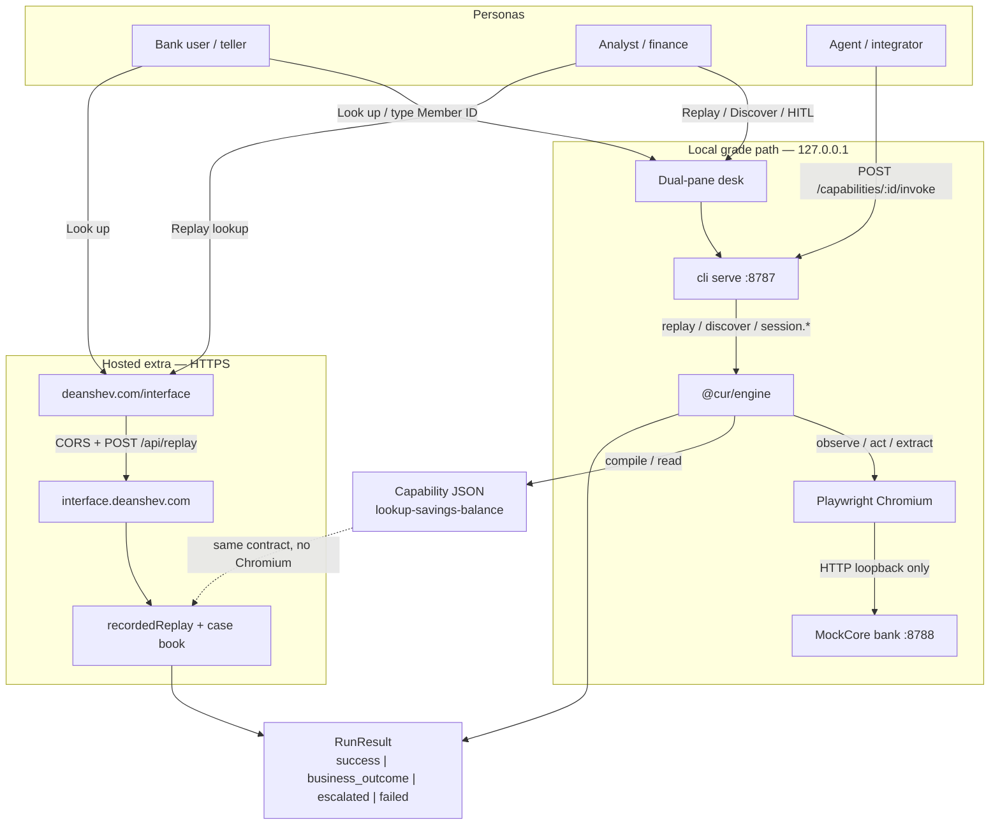
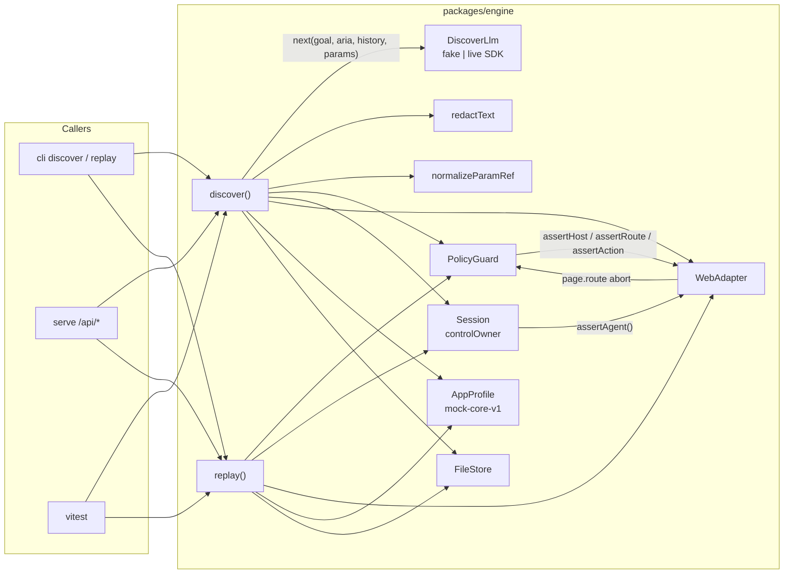
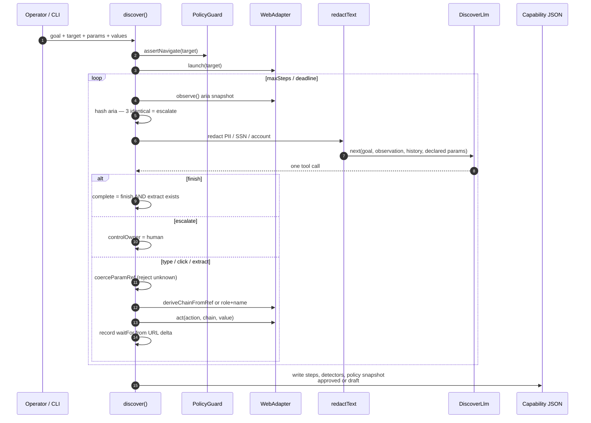
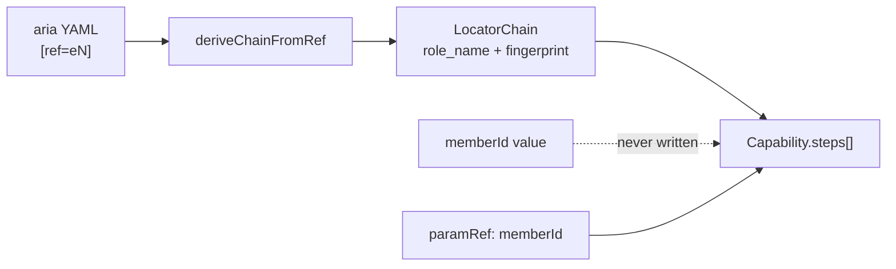
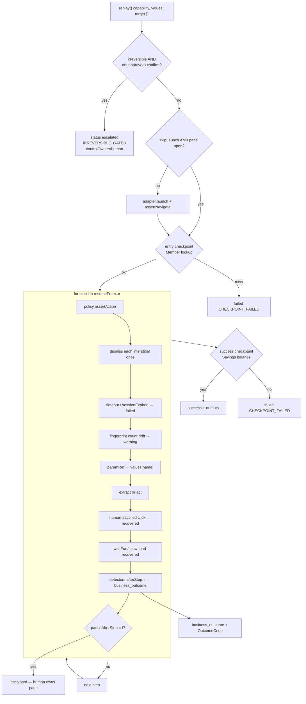
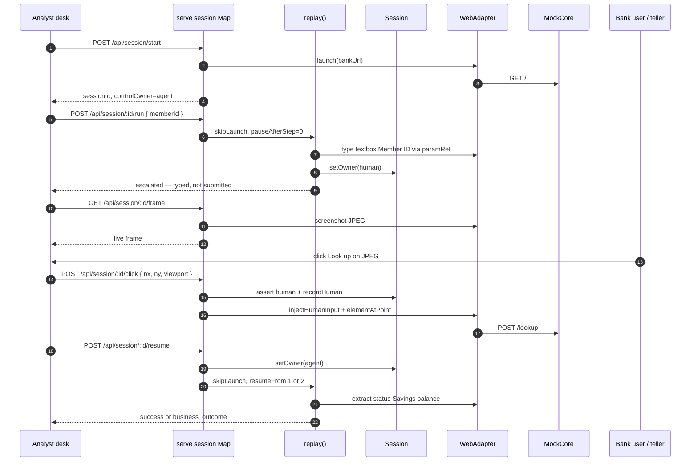
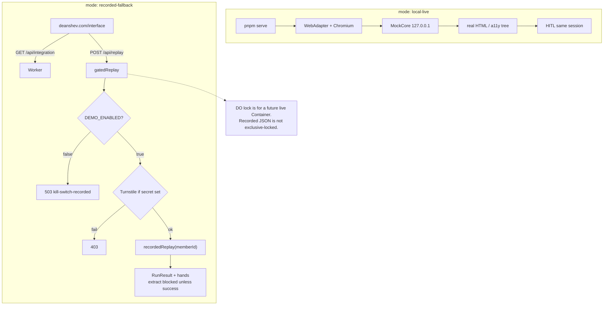
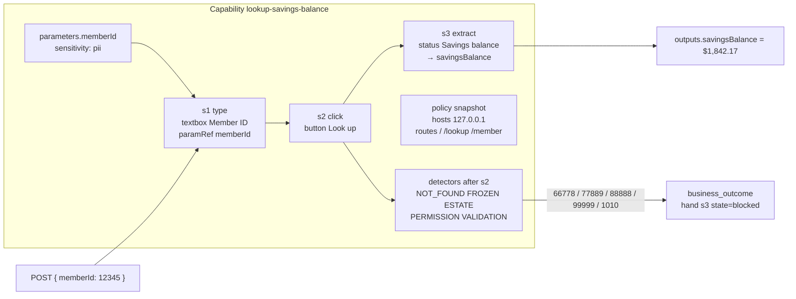
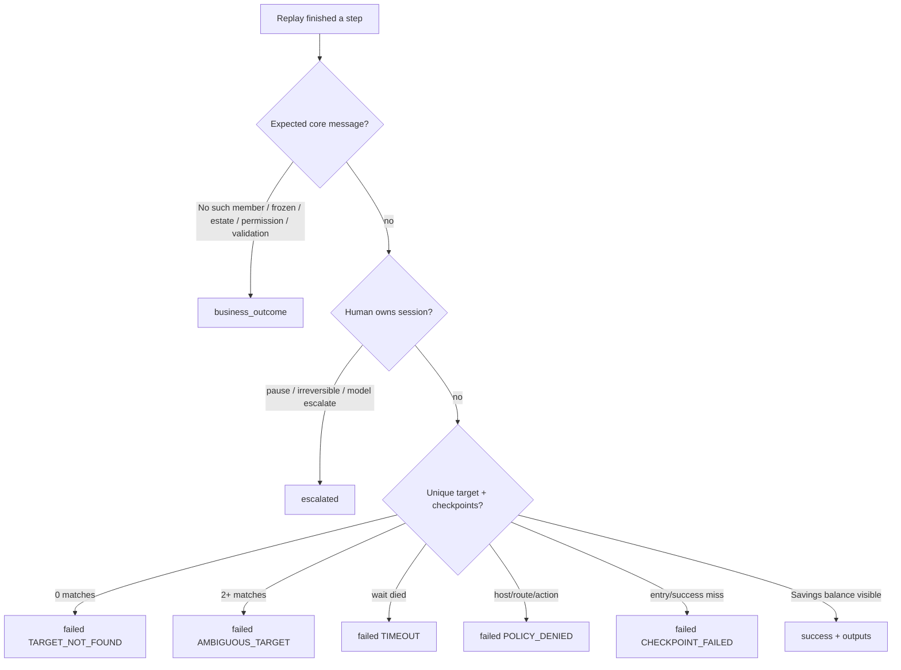

# Architecture diagrams

Wired views of the capability runtime. Each diagram is a connection map: boxes are components, labeled edges are the actual contracts that travel between them.

Source of truth for these drawings: this file. The briefing at [deanshev.com/interface](https://deanshev.com/interface#wiring) renders the same maps. Narrative lives in [ARCHITECTURE.md](./ARCHITECTURE.md).

## Table of contents

1. [System wiring](#1-system-wiring)
2. [Engine backplane](#2-engine-backplane)
3. [Discover compile path](#3-discover-compile-path)
4. [Replay interpreter](#4-replay-interpreter)
5. [HITL same-session](#5-hitl-same-session)
6. [Hosted vs local honesty](#6-hosted-vs-local-honesty)
7. [Capability contract and hands](#7-capability-contract-and-hands)
8. [Outcome taxonomy](#8-outcome-taxonomy)

---

## 1. System wiring

Three personas share one invoke contract. The bank never leaves loopback. The public briefing is a client of the Worker, not a second product.

**Wires that matter**

| From | Trace | To | What travels |
| --- | --- | --- | --- |
| Desk / briefing | `POST /api/replay` | Engine or Worker | `{ memberId }` |
| Engine | `SurfaceAdapter.act` | Chromium | action + locator chain |
| Chromium | HTTP | MockCore | form POST `/lookup` |
| Discover | compile | Capability JSON | steps, `paramRef`, detectors, policy snapshot |
| Replay / recorded | return | Caller | `RunResult` + optional `hands[]` |

---

## 2. Engine backplane

Every production act goes through policy and session ownership before it touches the page. The LLM is a discover-only plug.

**Wires that matter**

| Trace | Enforced by | Fail closed as |
| --- | --- | --- |
| host + route + action | `PolicyGuard` | `POLICY_DENIED` |
| `/` is exact, not a prefix | `routeMatches` | `POLICY_DENIED` |
| agent act while human owns | `Session.assertAgent` | throw; HITL continues |
| unknown `paramRef` | `normalizeParamRef` | `UNKNOWN_PARAM_REF` |
| PII in the prompt | `redactText` before `llm.next` | value replaced |

---

## 3. Discover compile path

The model only picks a tool. The engine records what actually resolved. Status is `draft` unless `finish` and an `extract` both happened.

---

## 4. Replay interpreter

No model. The artifact is the program. Detectors fire after the lookup click so a freeze is not `TARGET_NOT_FOUND`.

---

## 5. HITL same-session

A new browser would drop the typed field, the chaos cookie, and the teller’s place. Pause and resume keep the Playwright page.

---

## 6. Hosted vs local honesty

HTTPS cannot drive loopback Chromium. The Worker prints the same contract from the case book. That is a cut, not a disguise.

---

## 7. Capability contract and hands

The integration layer is three typed steps plus a policy snapshot. Front-ends visualize `hands[]`; they do not invent locators.

Stable accessible names — the only locators the bank may expose:

`Member lookup` · `Member ID` · `Look up` · `Savings balance` · `Open sub-account` · `Confirm open` · `Dismiss notice`

---

## 8. Outcome taxonomy

`IRREVERSIBLE_GATED` is a failure/escalation code, not a credit-union message. `ACCOUNT_FROZEN` is the opposite: the locators worked and the core said no.
